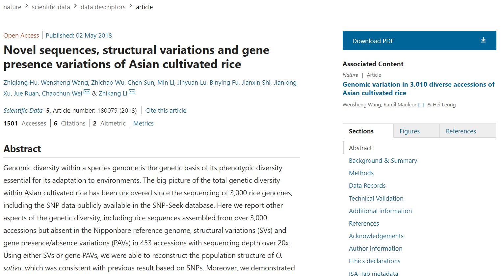

#RISS
##Description(项目简介)
>我们采访了上海交通大学生命科学与技术学院生物信息学与生物统计系的魏朝春教授，以及主要从事水稻基因研究的研究生。然后，我们**调查了3010种亚洲栽培水稻在自然界的多样性变化，以了解水稻基因组的测序技术和共同特征筛选标准**。
>受中国成就的鼓舞，我们的项目将为水稻遗传学提供充分的新技术知识和坚实的水稻育种理论基础。**我们的项目旨在帮助与 Oryza水稻之一相关的<u>应力耐受性</u>实验研究。<u>我们建立了一个数据库，包括基因，RNA-seq，蛋白质和其他重要的信息，Oryza水稻。我们还帮助评估和标记未发现的基因，以便我们可以向研究人员推荐最可能与压力耐受性相关的基因**</u>。

##Engineering
~~下次一定~~
[见此处](/4/sjtu_software_algorithm.md)
##Implementation
###项目简述：
>我们的项目主要为水稻实验者提供一个数据集，用于查找和搜索相关基因，以修改基因或为特定组选择一些样本。如果用户输入基因名称或别名，数据库将返回与该基因相关的所有信息。

###实现过程：
>首先，我们有基因注释，包括参考序列、来源、序列本体、起始和结束位置、链、阶段和属性。
>***
>其次，我们利用改进的贪婪等价搜索算法（GES）生成基因-基因关系和基因-表现型关系，这意味着它可以在输入基因名称后返回所有相关基因和表现型，这对实验者具有重要意义。
>***
>例如，如果研究人员发现了一个抗应激基因，他们可以研究可能具有相似功能的相关基因；如果对某个基因进行修改不方便，则可以适当地对相关基因进行研究和修改。并对旗叶角、粒长、粒重、粒宽、高、叶角、叶长、叶宽进行了表现型关联分析。*
\
如果我们有更多的信息，我们可以对它们进行快速准确的类似分析。我们的样本交互部分包含聚类和全局搜索，可以为特定植物的关系提供新的见解。

###结果
>我们从3010个样本中选择453个来构建PAV矩阵。PAV矩阵中的每一行表示一个基因，每一列表示一个样本。基于序列数据，我们计算了一个基因的覆盖率，并根据我们的阈值转换成一个二进制值。

关于*PAV矩阵*，搜索时发现一篇<a href="https://www.nature.com/articles/sdata201879">nature：Novel sequences, structural variations and gene presence variations of Asian cultivated rice

    
     
    
“自给自足”

</a>

>我们从文献中手动收集了24个抗性基因，我们想知道这些基因是否存在于453个样本中。令人惊讶的是，我们在PAV基质中发现了24个基因中的14个，其中9个被鉴定为核心基因。
>***
>对于453种植物中存在的14个抗性基因，我们提供了一个基于[lastz(Harris,2007)](http://www.bx.psu.edu/~rsharris/rsharris_phd_thesis_2007.pdf)工作的[在线工具](plant.ensembl.org)，用户可以将抗性基因与其他所有植物的CDS进行比较。
>***
>对于其他5个非核心基因，我们还研究了表型与基因型的关系。对于软核基因和分布基因，根据基因表达与否对不同性状进行多元分析，找到了几个有意义的基因。$X21$对粒长和粒重有显著影响，而$ZFP252$对植株有显著影响身高。这些基因可能通过这种方式影响水稻的抗逆性。

##Contribution(项目贡献)
###启下
>本项目解决了"通过基因编辑进行高产线育种"这一宏大合成生物学问题的一部分，即筛选出与已知基因相关的基因，为后续研究提供参考。我们的项目是一个宝贵的灵感，因为后续的研究团队可以在此基础上引入下游转录和转化信息分析功能。它还可以进一步扩大物种的范围，实现进一步细化和完善。我们认为它将来会有一个良好的发展前景。
###数据库和工具
>我们的数据库可以分为两部分：基因信息，另一部分是关于样本。
我们的团队成员从关于水稻耐应力的文件中搜索并收集了一些耐应力基因和基因家族。我们的团队根据这些基因和基因家族创建了基因注释表、序列表和基因表。我们的团队还利用这些数据使用 GES 算法、FR 算法、K-means 算法和均移算法创建新表。
研究人员可以搜索泛基因组基因注释和序列，或者他们可以找到这些基因或样本之间的关系。
###游戏
>为了向公众推广合成生物学和 iGEM，我们开发了虚拟实验游戏和益智合成生物学"2048"游戏。玩家可以在这些游戏中学习基本的生命科学理论，并学习一些有关合成生物学的基本知识。在虚拟实验游戏中，实验成功的关键是运用基础知识正确进行实验，达到实验目的。在实际的人类实践中，学生首先学习知识，进一步巩固游戏中的知识。
###课程
>在西宁的HP中，我们为中国西部的中学生开发了丰富的课程，包括应用基因工程和合成生物学知识，以及基因工程在生物学中的应用。考虑到Covid-19的影响，我们还专门教授病毒感染机制和如何预防感染。除了体验游戏，我们相信教学教育可以更有效地提高公众对合成生物学的理解和认识。
