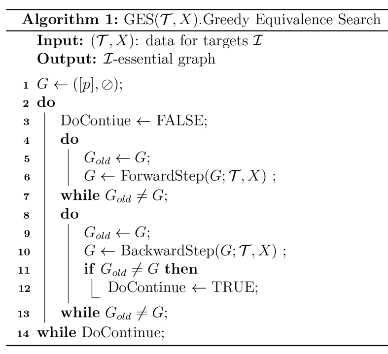
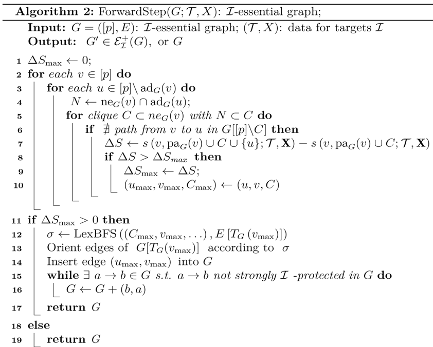
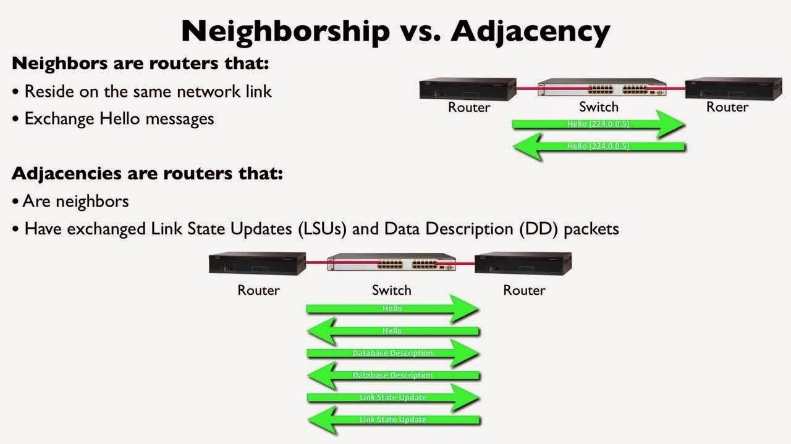
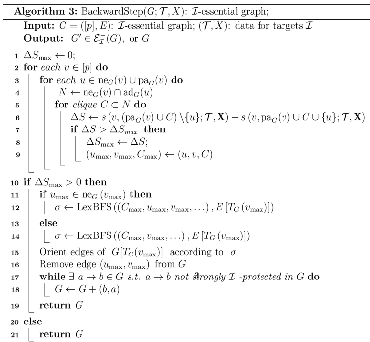
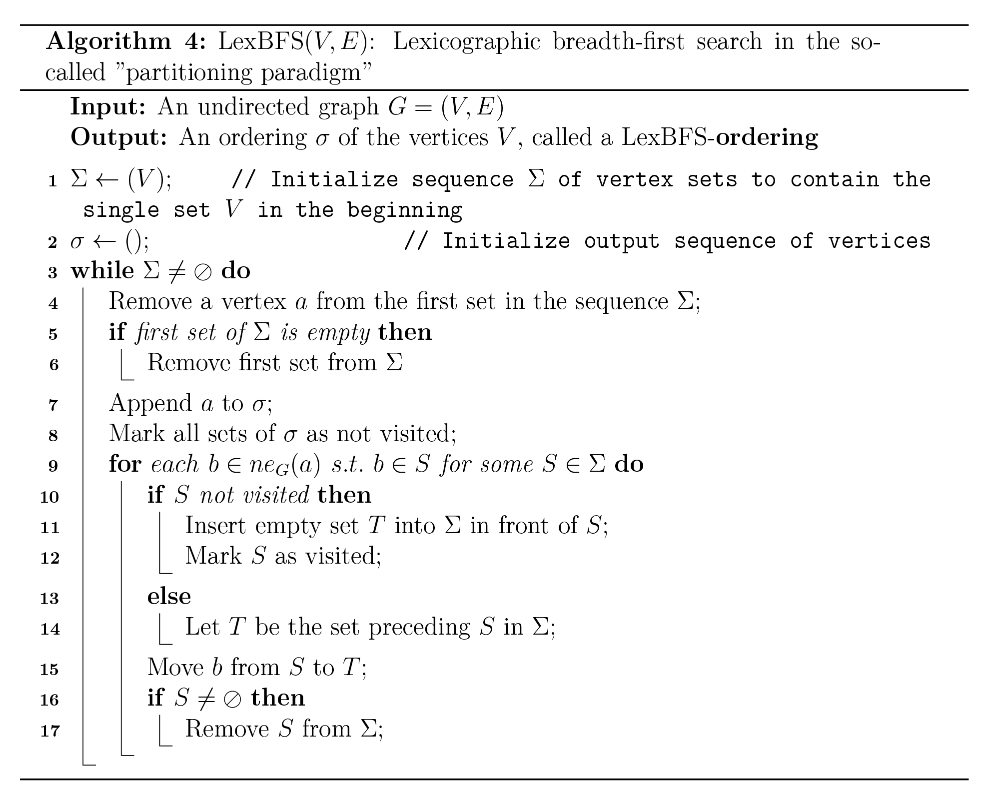
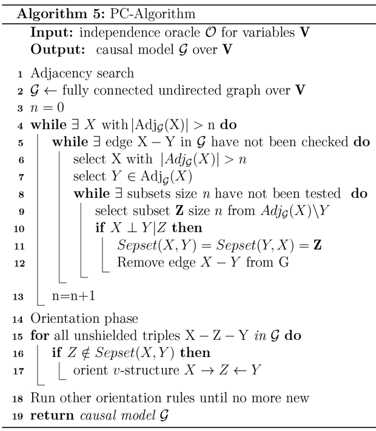
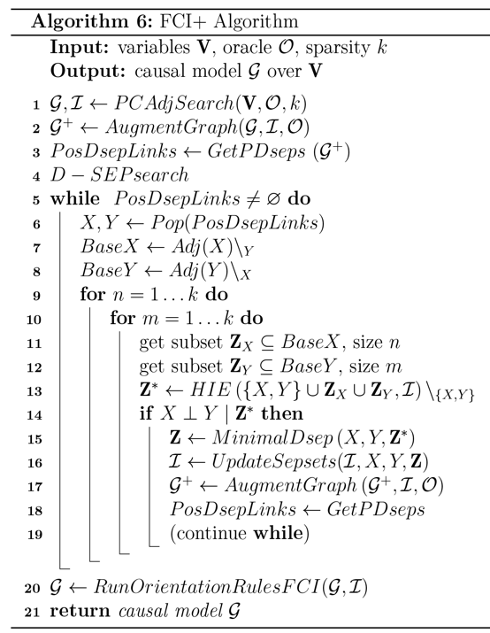
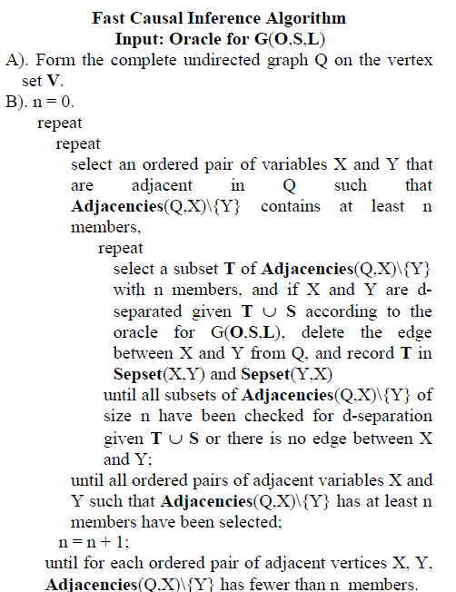
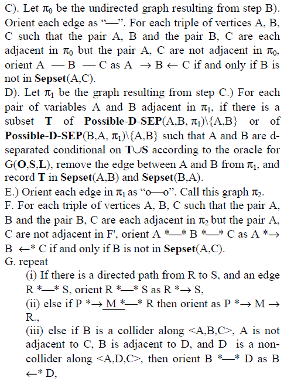
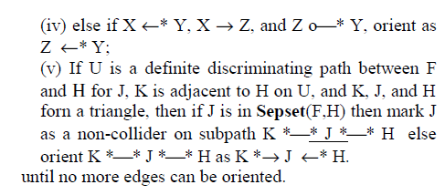

#SJTU-Software-algorithm

auth: 高梓源 finishing time: 4-5h

***

##1.GES algorithm

Greedy Equivalence Search(Meek,1997)为其博士论文内容

>Meek C. Graphical Models: Selecting causal and statistical models. PhD thesis, Carnegie Mellon University (1997).

属于贝叶斯算法，根本而言，启发式搜索数据集并返回[贝叶斯得分](https://www.coursera.org/lecture/probabilistic-graphical-models-3-learning/bayesian-scores-oLjrV)最高的模型(model or gragh<u>连线方法</u>)

<table border="0" style="width:100%;">
 <tr style="background-color:#1aef3a">
    <td><b style="font-size:20px">GES</b></td>
    <td><b style="font-size:20px">Explaination</b></td>
 </tr>
 <tr>
    <td style="width:300px;" ></td>
    <td>
    1.Input一个训练集，返回一个最优模型 
    2.从空图(只有顶点无边)开始搜索 
    3.先执行向前搜索增加边和总得分，直到贝叶斯得分不再增加为止 
    4.再执行向后搜索剔除边，同样直到贝叶斯得分不再增加为止
    </td>
 </tr>
 <tr style="background-color:#1b38de">
    <td><b style="font-size:20px;color:white">FES</b></td>
    <td><b style="font-size:20px"></b></td>
 </tr>
 <tr style="background-color:#b6f1fc">
    <td><b style="font-size:15px">1.迭代</b></td>
    <td><b style="font-size:20px"></b></td>
 </tr>
 <tr>
    <td style="width:60%;" ></td>
    <td>
    1.Input一个训练集，返回一个最优模型 
    2.求贝叶斯得分S最大值，先设为0 
    3.对已知图的每一点 
    4.对不属于该图的每一点 
    </td>
 </tr>
 <tr>
    <td style="width:60%;" ><a href="https://www.quora.com/What-is-the-difference-between-neighbor-and-adjacency-in-OSPF">
    Reference:Quora.com 
    </a>
    </td>
    <td>
    ne-neighbour;ad-adjacent表面上都是相邻，事实上意思不同，在数据库中常用，前者表示只相邻但不共享全部数据，而后者也称"full state"共享private数据 
    </td>
 </tr>
 <tr>
    <td style="width:60%;" >
    
    </td>
    <td>
    1.能够和u共享全部数据的点集，和与v相邻的点集的交，赋给N 
    2.此对v的任意临边集C 
    3.若在已知点集除去C的图中，不存在v到u的路径 
    4.将1.u加入已知点集及临边集，将贝叶斯得分减去原先赋值到S 
    5.判断新形成的图是否为最大值，是则更新，记录点边及临边集 
    </td>
 </tr>
 <tr style="background-color:#b6f1fc">
    <td><b style="font-size:15px">2.更新原图</b></td>
    <td><b style="font-size:20px"></b></td>
 </tr>
 <tr>
    <td style="width:60%;" >
    
    </td>
    <td>
    1.若寻找到了更大的贝叶斯得分，则将新点与新边加入原图，由宽度优先搜索确定边的方向 
    2.否则返回原图 
    </td>
 </tr>
 <tr style="background-color:#85f493">
    <td><b style="font-size:20px;color:#c635ed;">BES</b></td>
    <td><b style="font-size:15px">与FES非常类似</b></td>
 </tr>
 <tr>
    <td style="width:60%" >
    
    </td>
    <td>
    1.不同之处在于u选取v的邻居和相邻点，而C集的选取变为N的子集 
    2.此时只需要将u去掉，判断新的贝叶斯得分是否为最大，是则替换，将u,v,C记录 
    </td>
 </tr>
 <tr style="background-color:#f8efe2">
    <td><b style="font-size:15px">2.更新原图</b></td>
    <td><b style="font-size:20px"></b></td>
 </tr>
 <tr>
    <td style="width:60%" >
    
    </td>
    <td>
    1.在贝叶斯得分增加时新增一次判断，当u在v的neighbour中，宽度优先搜索时需要考虑v；否则不需要 
    2.此时只需要将u去掉，判断新的贝叶斯得分是否为最大，是则替换，将u,v,C记录 
    </td>
 </tr>
</table>

##2.LexBFS

[简介：字典广度优先搜索](https://en.wikipedia.org/wiki/Lexicographic_breadth-first_search)

简而言之，即用基于字典排序和字符图集的<u>**BFS**</u>
[简介：广度优先搜索(BFS)](https://en.wikipedia.org/wiki/Breadth-first_search)

简而言之，先遍历本层，被强制退出时向下层搜索

<table>
   <tr>
      <td style="width:60%">
      
      </td>
      <td>
      1.输入：无向图(V,E)；输出：排序完成的图 
      2.定义输入树X和输出树x，输入树按照BFS遍历， 
      3.对于每次遍历X中节点a且输入x后，令x中所有元素未被访问，对a所有邻居b，且b在原X子集中 
      4.若S未被访问，将空集T插入S前，否则令T为S前一个集合，而后将b放入T，完成BFS遍历结果的构建 
      5.上步即一个BFS过程，首先遍历X元素，找到相邻元素作为potential节点插入，之后当本层遍历完成，下一层也被构建，最后将整个S从X中移除 
      </td>
   </tr>
</table>

##3.PC

<table>
   <tr>
      <td style="width:60%">
      
      </td>
      <td>
      1.输入：对变量V的独立数据库；输出：V上的随机模型G 
      简单而言，PC算法分为两步： 
      1.根据已有图通过搜索邻接点的方式学习； 
      2.将无向边定向来形成DAG的等价类； 
      DAG：Directed Acyclic Graph连通无环图，DAG等价类有两种表达形式： 
      1.图具有相同的骨架和V型结构； 
      2.CPDAG：completed partially directed acyclic graph完整的部分有向无环图，存在无向边 
      PS：Sepset:分裂集 
      </td>
   </tr>
</table>
缺点：在随机模型中错过分离的集合，即结点不邻接，因此对于邻接搜索增加一个阶段。

##4.FCI+

FCI因果推断算法(Spirtes, Meek, and Richardson,1999)；

<table>
   <tr>
      <td style="width:50%">
      
      </td>
      <td>
      
看不懂的别看了

      </td>
   </tr>
   <tr>
      <td style="width:50%">
      
      </td>
      <td>
      
      </td>
   </tr>
   <tr>
      <td style="width:50%;background-color:#a3ffd3">
      
<b>这是文献上更详细的FCI算法</b>
 
      </td>
      <td>
      
      </td>
   </tr>
</table>

##Reference

[[1] A fast PC algorithm for high dimensional causal discovery with multi-core PCs; Thuc Duy Le, Tao Hoang, Jiuyong Li, Lin Liu, Huawen Liu, and Shu Hu](http://whatcanyousee.gearhostpreview.com/iGEM-software/PC.pdf)

[[2] An Anytime Algorithm for Causal Inference; Peter Spirtes](http://whatcanyousee.gearhostpreview.com/iGEM-software/FCI.pdf)

[[3] Scoring functions for learning Bayesian networks; Alexandra M. Carvalho](http://whatcanyousee.gearhostpreview.com/iGEM-software/贝叶斯.pdf)

[[4] Introduction to Causal Inference; Peter Spirtes](http://whatcanyousee.gearhostpreview.com/iGEM-software/spirtes10a.pdf)

[[5] A PPT about LexFBS](http://whatcanyousee.gearhostpreview.com/iGEM-software/LexFBS-ppt.pdf)

[6] Many websites